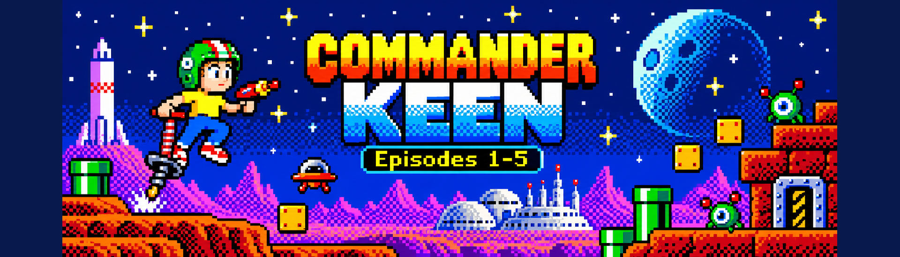

# Commander Keen Evercade



Commander Keen Evercade is a community-developed **homebrew** project that
packages Commander Genius for use on the original Evercade handheld with EverSD.

Version: **v0.1.0**

This repository and release do **not** include Commander Keen commercial game
data. Users must provide game files from copies they are legally entitled to use.

## v0.1.0 status

v0.1.0 has been hardware-tested on the original Evercade handheld with EverSD.

Validated behavior includes:

- native EverSD launch
- Commander Genius ARM runtime
- 480x272 fullscreen handheld profile
- controller input
- MENU access to the Commander Genius menu
- Keen Episodes 1-5 with user-supplied game data
- sanitized runtime with personal build paths removed
- release ELF files stripped
- RPATH/RUNPATH removed from the distributed runtime

## Install

Download and extract `Commander-Keen-Evercade-v0.1.0.zip`.

Inside the extracted package are three directories:

```text
commanderkeen/
game/
special/
```

Copy **all three directories directly to the root of the EverSD card**.

After copying, the root of the SD card should look like this:

```text
SD CARD ROOT/
├── commanderkeen/
├── game/
└── special/
```

The correct EverSD paths are:

```text
/commanderkeen/
/game/
/special/
```

Do **not** put these three directories inside another folder like this:

```text
SD CARD ROOT/
└── Commander-Keen-Evercade-v0.1.0/
    ├── commanderkeen/
    ├── game/
    └── special/
```

For example, after installation the Commander Genius executable should be at:

```text
/commanderkeen/bin/CGeniusExe
```

and the EverSD launcher should be at:

```text
/special/commanderkeen.sh
```

## Add Your Commander Keen Game Files

Commander Keen game data is/are **not included** with this homebrew release.

You must provide the game files from a copy you are legally entitled to use,
such as the Commander Keen Complete Pack from GOG.

Copy each episode's files into the matching directory on the EverSD card:

```text
/commanderkeen/home/.CommanderGenius/games/keen1/
/commanderkeen/home/.CommanderGenius/games/keen2/
/commanderkeen/home/.CommanderGenius/games/keen3/
/commanderkeen/home/.CommanderGenius/games/keen4/
/commanderkeen/home/.CommanderGenius/games/keen5/
```

The resulting directory layout should look like this:

```text
SD CARD ROOT/
└── commanderkeen/
    └── home/
        └── .CommanderGenius/
            └── games/
                ├── keen1/
                ├── keen2/
                ├── keen3/
                ├── keen4/
                └── keen5/
```

Place only the files for each episode in its corresponding directory.

Do not rename the original Commander Keen game files.

See `GAME_DATA.md` for additional information.

## Extracting the GOG Game Files

If you purchased the Commander Keen Complete Pack from GOG, the game files may
be contained inside the GOG Windows installer.

You do **not** need to install or run the games on the Evercade.

Instead, extract or install the GOG package on your computer, locate the original
Commander Keen episode files, and copy them into the corresponding `keen1`
through `keen5` directories on the EverSD card.

### Windows

The simplest method is to install the GOG package normally on your Windows PC.

After installation, locate the Commander Keen game directory and copy the files
for each episode into the matching EverSD directory:

```text
keen1 -> /commanderkeen/home/.CommanderGenius/games/keen1/
keen2 -> /commanderkeen/home/.CommanderGenius/games/keen2/
keen3 -> /commanderkeen/home/.CommanderGenius/games/keen3/
keen4 -> /commanderkeen/home/.CommanderGenius/games/keen4/
keen5 -> /commanderkeen/home/.CommanderGenius/games/keen5/
```

You can also use a tool capable of extracting Inno Setup installers if you do
not want to perform a normal Windows installation.

### Linux

The GOG installer can usually be extracted with `innoextract`.

For example:

```bash
innoextract setup_commander_keen_complete_pack_*.exe
```

After extraction, locate the files for each Commander Keen episode and copy them
into the matching `keen1` through `keen5` directories on the EverSD card.

### macOS

The GOG Windows installer can also be extracted with an Inno Setup extraction
tool such as `innoextract`.  Installing `innoextract` on macOS is not covered in this README.md.

After extraction, locate the files for each Commander Keen episode and copy them
into the matching `keen1` through `keen5` directories on the EverSD card.

The important part is the same on every platform: obtain the original Commander
Keen episode data from a copy you are legally entitled to use and place each
episode's files in the corresponding EverSD directory.

## Controller labels

EverSD metadata displays the v0.1.0 controls as:

- D-pad: Move
- A: Jump
- B: Pogo
- X: Fire
- Y: Run
- Select: Help
- Start: Status
- L1: Camlead

The Commander Genius runtime also has its tested Back/MENU binding internally.

## Repository layout

- `evercade/Commander-Keen-EverSD/` - complete EverSD payload
- `release/` - ready-to-install v0.1.0 ZIP and checksum
- `docs/` - build and hardware notes
- `game-data/` - placeholder only; never commit commercial game data
- `src/` - source/provenance notes for the upstream engine
- `scripts/` - release audit helper

## Upstream

Commander Genius revision used for this build:

```text
fb66a50d7b1fb3d2305f4fc727eaff27edb9f87b
```

See `UPSTREAM.md` and `THIRD_PARTY_NOTICES.md`.

## Non-affiliation

This is a homebrew community project. It is not affiliated with or endorsed by
id Software, ZeniMax, Microsoft, Blaze Entertainment, Evercade, GOG, or the
Commander Genius project.
